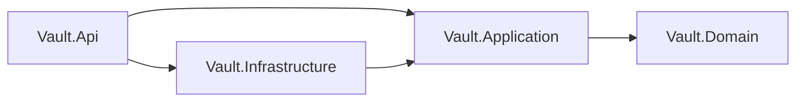
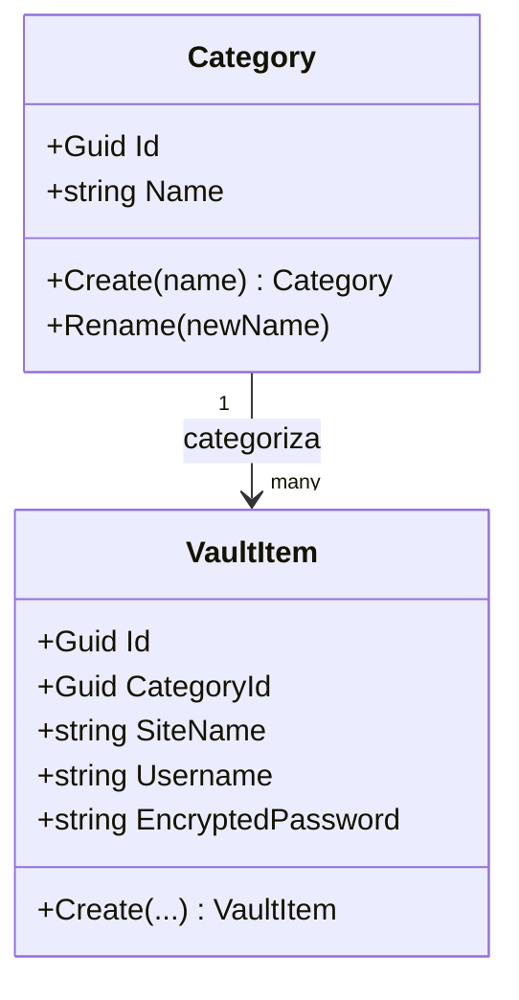

# Vault

Gestor de contraseñas multi-cliente (móvil, escritorio, web) sobre una única API.

## Stack
.NET 10 · C# 14 · Clean Architecture · EF Core · PostgreSQL · Redis · JWT

## Arquitectura

## Modelo de dominio

## Requisitos previos
1. .NET SDK 10
2. Docker Desktop
3. Visual Studio 2026 Community
4. Git
5. pgAdmin 4
6. RedisInsight
7. k6

## Flujo de Git
- `main` está protegida: todo cambio pasa por Pull Request, sin excepciones para administradores.
- Convención de ramas: `<tipo>/<descripción-corta>` (feat, fix, docs, chore, refactor, test).
- Convención de commits: Conventional Commits.

## Setup local
1. .NET 10 SDK
2. Docker Desktop (Postgres + Redis en contenedores — se añade en el Módulo 3/4)
3. `dotnet build` desde la raíz

## Decisiones de arquitectura
Ver carpeta `/docs/adr` (se añadirá cuando haya la primera decisión relevante).

## Repositorios
Contratos definidos en Vault.Application, con implementaciones temporales en memoria
(se reemplazan por EF Core en el Módulo 3):
- `IVaultItemRepository` → `InMemoryVaultItemRepository`
  Incluye `GetWeakPasswordItemsAsync()`, que evalúa fortaleza sobre `EncryptedPassword`
  asumiendo (temporalmente) que sigue siendo texto plano — ver comentario en el código.
- `ICategoryRepository` → `InMemoryCategoryRepository`

## Organización de endpoints
Los endpoints se agrupan por dominio en Vault.Api/Endpoints/ (extension methods sobre WebApplication),
no directamente en Program.cs. Minimal APIs elegido sobre Controllers por simplicidad para una API pura.

## Endpoints
- `GET /vault-items/stats` — conteo total y de contraseñas débiles. Usa await secuencial
  (no Task.WhenAll) porque las implementaciones actuales en memoria no tienen espera real de I/O;
  se reevaluará cuando EF Core reemplace estos repositorios en el Módulo 3.