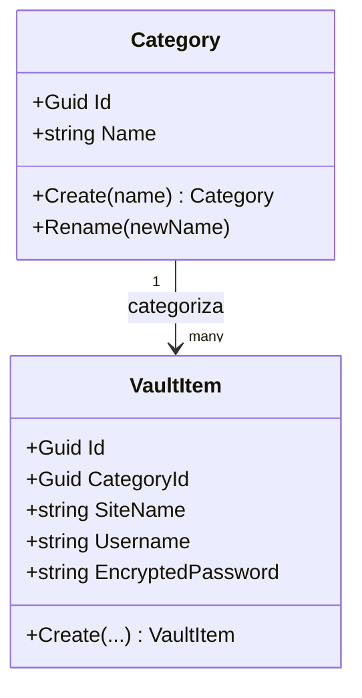

## Modelo de dominio

```mermaid
classDiagram
    class Category {
        +Guid Id
        +string Name
        +Create(name) Category
        +Rename(newName)
    }
    class VaultItem {
        +Guid Id
        +Guid CategoryId
        +string SiteName
        +string Username
        +string EncryptedPassword
        +Create(...) VaultItem
    }
    Category "1" --> "many" VaultItem : categoriza
```